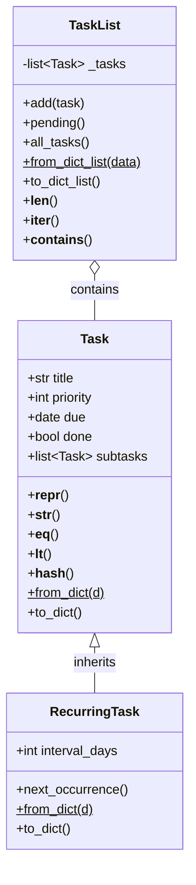

# Task Tracker – Capstone Project

A polished CLI application to manage tasks with subtasks, recurring tasks, and JSON persistence.

## Installation

```bash
# Clone or navigate to your project folder
cd tasktracker

# Install in editable mode
pip install -e .
```

## How to use and examples

# Add a new task
```bash
python -m tasktracker.cli add "Finish report" --priority 1 --due 2026-07-15
```

# Add a recurring task
```bash
python -m tasktracker.cli add "Weekly review" --priority 2 --due 2026-07-12 --interval 7
```
# Add a subtask

```bash
python -m tasktracker.cli add "Write introduction" --parent "Finish report" --due 2026-07-10
```

# List pending tasks
```bash
python -m tasktracker.cli list
```

# Show task tree
```bash
python -m tasktracker.cli show "Finish report"
```


# Mark as done
```bash
python -m tasktracker.cli done "Write introduction"
```

# List all tasks (including done)
```bash
python -m tasktracker.cli list --all
```

# Get current weather for a city 
```bash
python -m tasktracker.cli weather "Miami"
```

