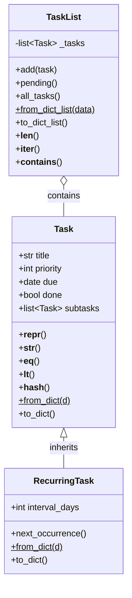

# Task Tracker – Capstone Project

A polished CLI application to manage tasks with subtasks, recurring tasks, and JSON persistence.

## Installation

```bash
pip install -e .

# Add a new task
tasktracker add "Finish report" --priority 1 --due 2026-07-15

# Add a recurring task
tasktracker add "Weekly review" --priority 2 --due 2026-07-12 --interval 7

# Add a subtask
tasktracker add "Write introduction" --parent "Finish report" --due 2026-07-10

# List pending tasks
tasktracker list

# Show task tree
tasktracker show "Finish report"

# Mark as done
tasktracker done "Write introduction"

# List all tasks (including done)
tasktracker list --all



